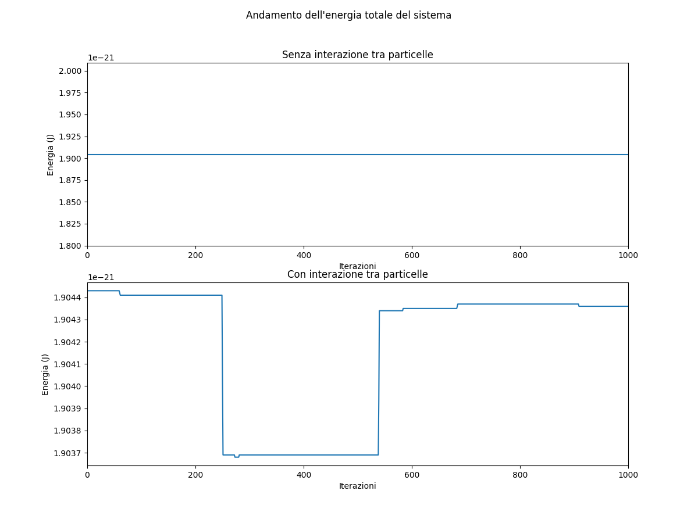
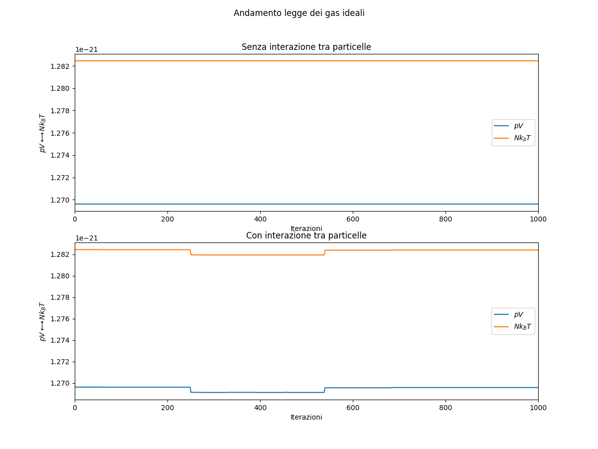

# Ideal gas simulation
Simulation of an ideal gas using the Metropolis algorithm to set up the initial conditions of N argon atoms, and using the Velocity-Verlet propagator to simulate particles moving.

Two main configurations are available:
- atoms do not interact at all;
- atoms interact via Lennard-Jones potential.

To compare the two configurations it is recommended to run _simulazione.cc_ both times with the same parameters (y/n option excluded obv.). 

_animazione.py_ creates three files:
- _comparazioneEnergia.png_ highlights the sistem's energy evolution over time;
- _comparazioneLegge.png_ helps seeing if the ideal gas law is actually followed;
- _comparazioneParticelle.gif_ represents the actual sistem evolving.  

Here is an example of the output you could expect:

